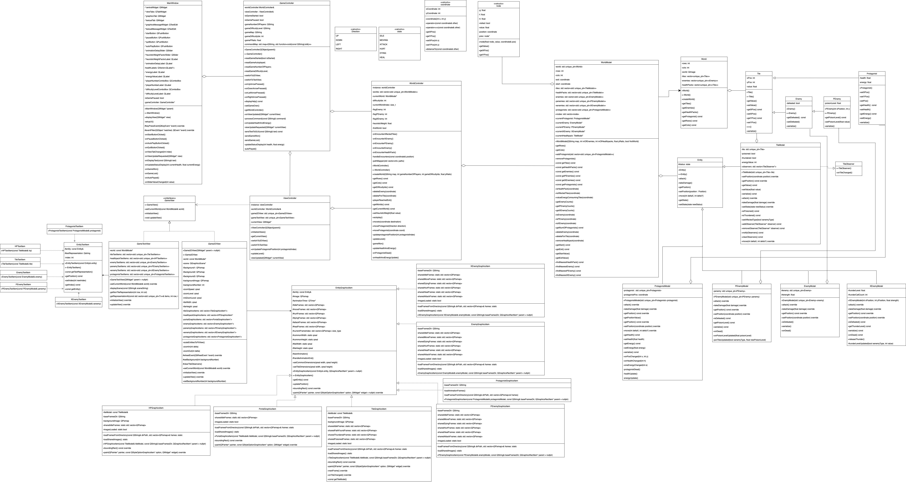
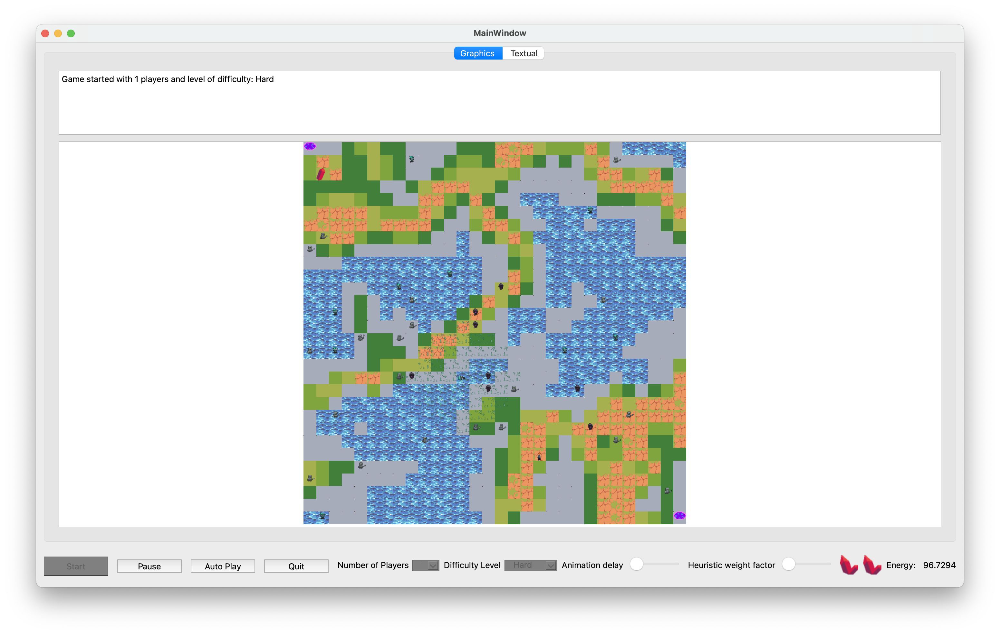
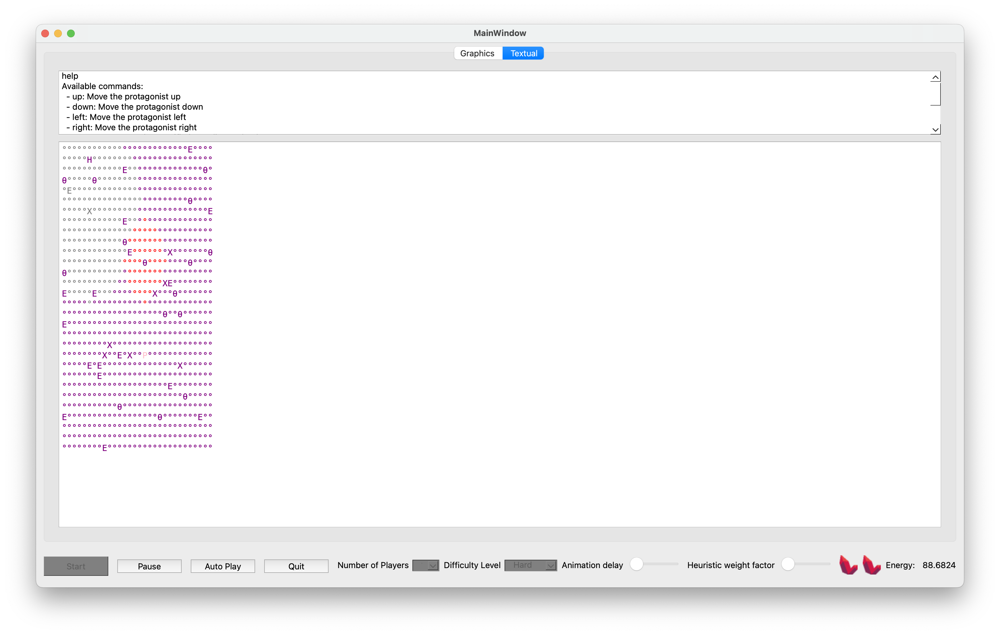

# Project Name 🚀

[](LICENSE.md)

## Table of Contents 📋
- [Project Description](#project-description)
- [Features](#features)
- [Prerequisites](#prerequisites)
- [Getting Started](#getting-started)
- [Usage](#usage)
- [Screenshots](#screenshots)
- [UML Diagram](#uml-diagram)
- [Naming Convention](#naming-convention)
- [Contributing](#contributing)
- [License](#license)
- [Acknowledgments](#acknowledgments)


## Project Description 📄

Welcome to AdventureQuest! 🌟

AdventureQuest is an immersive role-playing game (RPG) that transports players into a dynamic and enchanting fantasy world. It aims to provide gamers with a rich, interactive experience that combines strategic gameplay and levels development. 

## Features 🌟

- 🖼️ **Runtime View Switching**: Easily switch between 2D, overlay, and text-based views during program execution.
- 🕹️ **Interactive Protagonist**: Control the protagonist using arrow keys for smooth navigation.
- 🕹️ **Auto-Play Mode**: Activate auto-play mode where the protagonist takes charge automatically.
- 🦹 **XEnemy**: Encounter and deal with the mysterious XEnemy with unique behavior.
- 🌐 **Path Visualization**: Visualize the path followed by the protagonist during auto-play.
- 🏞️ **Overlay Maps**: Experience a rich world with overlay maps, allowing for different visual and data layers.
- 🌍 **Multilevel Gameplay**: Transition between maps using special Tiles (Door/Portal) for diverse gameplay experiences.


## Prerequisites 🛠️

- C++ 20 are required for code compliation

## Getting Started 🚀

1. Clone the repository.
   ```bash
   git clone https://gitlab.kuleuven.be/groep-t/courses/apt/2324/team-a4-fa.git


## UML


## Contributing
- Jeffee Hsiung: Game Controller, World Controller, View Controller, Models (all), Views (all GraphicsItem, 2Dview, Textview), Mainwindow, Misc
- Ruicong Wang: Main Window (UI design and connect others), Game Controller, World Controller, World Model (Health and Energy)
- William Zhu: World Controller, World Model, autoplay, levels 

## Summarized Status Report
For detail descriptoin please refer to the status report PDF.
### Subtask A: Finished
- 2D graphical representations and animations of all characters using MVC design pattern.
- Various entity status animations (IDLE, ATTACK, MOVING, HURT, DYING).
- Healthpack visualization based on health values.
- Protagonist movement controlled by key presses (WASD).
- Observer pattern implemented for tile animations.
- Scaling function for graphical representation of items.

### Subtask B: Finished
- Graphical views and text views switchable via tabs.
- Text visualization in HTML format for color adaptation.
- ASCII art-like string-based visualization as an alternative.
- Color changes based on entity status.
- User interaction in text view via keypress or textual message widget.

### Subtask C: Finished
- Overlay with world map background.
- Graphical representation of tiles based on value.
- Special tile representations for different gameplay elements.
- Graphical scaling correlated with zoom functions.

### Subtask D: Finished
- Five initial world levels created.
- Level switch implemented for transitioning between maps.
- Sequential storage and indexing of world models for quick loading.

### Subtask E: Finished
- UI with visualization of protagonist's health and energy bars.
- Synchronized graphical and text-based world status representations.
- Implemented zoom in/out and scaling in graphical view.
- XEnemy with unique behavior including random health and teleportation.

### Future Improvements
- Introduce protagonist-chasing enemies for added excitement.
- Introduce compleing storylines.
- Explore Qt's caching functions for graphical optimization.

## License
[See the LICENSE file for license rights and limitations.](LICENSE.md)

## Screenshots



## Naming Convention
## Case Summary ##
| Type             | Convention    |
|------------------|---------------|
| Abstract Classes | PascalCase    |
| Concrete Classes | PascalCase    |
| Attributes       | camelCase     |
| Methods          | camelCase     |


## Usage
- Protagonist movement:
   - `key W`: up
   - `key S`: down
   - `key A`: left
   - `key D`: right

- Text Commands available:
   - `up`: Move the protagonist up.
   - `down`: Move the protagonist down.
   - `left`: Move the protagonist left.
   - `right`: Move the protagonist right.
   - `goto x y`: Move to the specified coordinates (x, y).
   - `attack`: Attack the nearest enemy.
   - `take`: Take the nearest health pack.
   - `help`: Display this help text.


## Acknowledgements

#### Individuals
- Professor Stefaan Desmet
- Teacher Jeroen Wauters

#### Resources
* **Craftpix.net** <br> [](https://craftpix.net)


